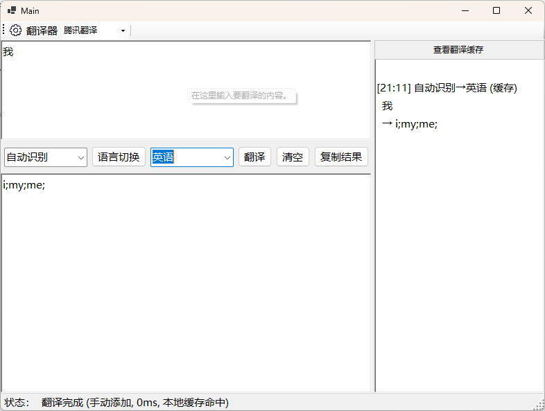
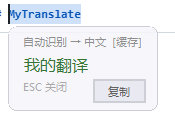
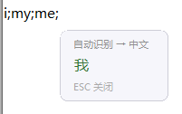
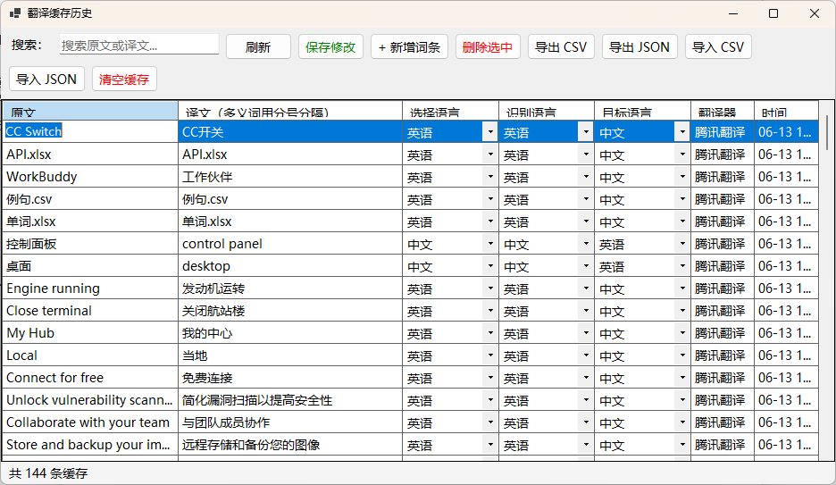
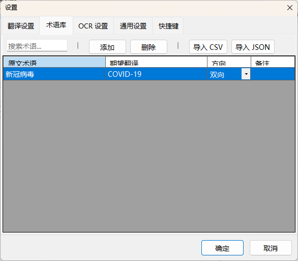
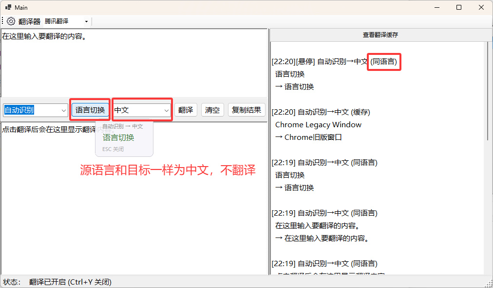
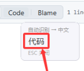

# MyTranslate

基于 C# / .NET 10 WinForms 的桌面翻译工具，支持手动输入翻译、全局划词翻译、全局悬停翻译、OCR 截图翻译四种模式。常驻系统托盘，通过 `Ctrl+Y` 全局快捷键开关翻译功能。

## 功能特性

### 四种翻译模式

| 模式 | 触发方式 | 说明 |
|------|---------|------|
| **手动翻译** | 主窗口输入文本，点击翻译按钮 | 支持语言互换、翻译历史、术语库 |
| **划词翻译** | 在任意应用中选中文本后松开鼠标 | 自动识别选区，气泡图标点击翻译 |
| **悬停翻译** | 鼠标停留在文字上方超过设定时间 | 自动识别鼠标位置文字并翻译 |
| **OCR 截图翻译** | 快捷键触发，鼠标框选屏幕区域 | 识别图片中的文字并翻译 |




<!-- TODO: 补充 OCR 截图翻译截图 -->


### 核心能力

- **多翻译引擎**：腾讯翻译（已实现）、百度翻译（预留）、阿里翻译（预留）

- **智能缓存**：正向/反向/链式三级缓存查找，减少 API 调用


- **术语库**：自定义术语翻译，支持方向控制（中→英、英→中、双向），CSV/JSON 批量导入导出


- **语言自动检测**：基于 Unicode 字符范围统计，支持中/日/韩/英/俄等语言
- **同语言跳过**：源语言与目标语言相同时直接返回原文，不消耗 API 额度
- **翻译来源追踪**：浮窗显示翻译来源标签（API / 缓存 / 术语库 / 同语言）
- **非翻译内容过滤**：自动跳过 URL、邮箱、文件路径、纯数字等无需翻译的内容


### 划词翻译

- 选中文本后出现气泡图标，点击触发翻译
- UI Automation 读取选区文字，剪贴板兜底
- 选区下方浮窗显示翻译结果，屏幕边缘自动避让
- 支持复制按钮、重翻按钮（跳过缓存强制调用 API）
- 智能分段：含 `[]` 或 `-` 的标题栏文本（如 `Code.txt [D:\Desktop] - Notepad4`）只翻译有意义的部分


### 悬停翻译

- 鼠标停留超过设定时间（默认 500ms）自动识别文字并翻译
- 四级读取策略：ValuePattern → TextPattern(Line/Paragraph/Word) → Name 属性 → 父容器 TextPattern
- 智能分段翻译，URI 方案过滤（`http://`、`app://` 等）
- 浮窗 8 秒自动消失，支持复制和重翻
- 文本去重：同一文本不重复翻译，鼠标移动 50px+ 自动重置

### OCR 截图翻译

- **区域截图翻译**：快捷键（默认 `Ctrl+Shift+Y`）触发全屏截图模式，鼠标拖拽框选区域
- **悬停 OCR 降级**：悬停翻译无法通过 UI Automation 读取文字时，自动截图 OCR 识别
- **划词 OCR 降级**：划词翻译无法读取选区时，自动 OCR 识别
- **双引擎**：Windows 内置 OCR（免费，本地识别）+ 腾讯 OCR（高精度，云端识别），自动降级
- **多行识别**：自动合并碎片行，去除空白行

<!-- TODO: 补充 OCR 截图模式截图（半透明遮罩 + 框选区域） -->

<!-- TODO: 补充 OCR 翻译结果浮窗截图 -->


### 翻译浮窗

- 选区下方 / 鼠标旁定位，屏幕边缘自动避让
- 圆角无边框设计，不抢焦点
- 缓存命中绿色文字、API 翻译黑色、翻译失败红色
- 8 秒自动消失 / 点击外部关闭
- 复制按钮 + 重翻按钮




## 支持语言

自动识别、中文（简体）、英语、日语、韩语、法语、德语、西班牙语、俄语

## 技术栈

| 技术 | 用途 |
|------|------|
| .NET 10 WinForms | 桌面应用框架 |
| TencentCloudSDK.tmt | 腾讯翻译 API |
| Windows.Media.Ocr | Windows 内置 OCR |
| TencentCloudSDK.ocr | 腾讯 OCR（高精度备选） |
| Win32 SetWindowsHookEx (WH_MOUSE_LL) | 全局鼠标钩子 |
| Windows UI Automation | 窗口文字读取 |
| GDI+ CopyFromScreen | 屏幕截图 |
| Win32 RegisterHotKey | 全局快捷键 |
| JSON (System.Text.Json) | 配置持久化 |

## 项目结构

```
MyTranslate/
├── Core/                          # 核心业务（与界面解耦）
│   ├── ITranslator.cs             # 翻译器统一接口
│   ├── TencentTranslator.cs       # 腾讯翻译实现
│   ├── BaiduTranslator.cs         # 百度翻译（预留）
│   ├── AlibabaTranslator.cs       # 阿里翻译（预留）
│   ├── TranslationEngine.cs       # 翻译调度器（规范化→同语言→缓存→术语→API）
│   ├── LanguageInfo.cs            # 语言枚举与 API 代码映射
│   ├── LanguageDetector.cs        # Unicode 范围语言检测
│   ├── TranslationResult.cs       # 翻译结果模型 + TranslationSource 枚举
│   ├── GlossaryEntry.cs           # 术语条目模型
│   ├── GlossaryManager.cs         # 术语库管理
│   └── TranslationHistoryManager.cs # 持久化多向缓存
├── Capture/                       # 文字捕获层
│   ├── GlobalMouseHook.cs         # 全局鼠标钩子（移动/悬停/点击/释放）
│   ├── UIAutomationReader.cs      # UI Automation 文字读取 + 选区 + 选区边界
│   ├── IOcrProvider.cs            # OCR 接口
│   ├── WindowsOcrProvider.cs      # Windows 内置 OCR（Windows.Media.Ocr）
│   ├── CloudOcrProvider.cs        # 云端 OCR（腾讯 GeneralBasicOCR）
│   ├── OcrManager.cs             # OCR 调度（优先本地，失败走云端 + 结果后处理）
│   ├── ScreenCaptureHelper.cs     # 屏幕截图辅助（区域截图 + 鼠标周围截图 + DPI 适配）
│   └── ClipboardHelper.cs         # 剪贴板辅助方案
├── Overlay/                       # 浮窗显示层
│   ├── OverlayForm.cs             # 浮窗基类（无边框/置顶/不抢焦点/圆角/淡入淡出）
│   ├── HoverOverlay.cs            # 悬停翻译浮窗
│   ├── SelectionOverlay.cs        # 划词翻译浮窗
│   ├── SelectionBubble.cs         # 划词翻译气泡图标
│   └── CaptureOverlay.cs          # OCR 区域截图浮窗（全屏遮罩 + 框选）
├── Services/                      # 系统服务
│   ├── AppConfig.cs               # 配置读写（JSON 持久化）
│   ├── HotkeyManager.cs           # 全局快捷键管理
│   ├── TrayManager.cs             # 系统托盘管理
│   ├── SelectionTranslationManager.cs # 划词翻译控制器
│   └── HoverTranslationManager.cs # 悬停翻译控制器
├── UI/                            # 用户界面
│   ├── SettingsForm.cs            # 设置窗口（5 个页签）
│   └── CacheViewerForm.cs         # 缓存查看器
├── Main_Translate.cs              # 主窗口逻辑
├── Main_Translate.Designer.cs     # 主窗口布局
├── Program.cs                     # 入口
└── App.config
```

## 配置说明

配置文件存储在 `%LocalAppData%/MyTranslate/config.json`，可通过设置界面修改：

### 翻译设置

| 配置项 | 说明 | 默认值 |
|--------|------|--------|
| 翻译引擎 | 腾讯/百度/阿里 | 腾讯 |
| 默认源语言 | 翻译源语言 | 自动识别 |
| 默认目标语言 | 翻译目标语言 | 英语 |

### 划词翻译

| 配置项 | 说明 | 默认值 |
|--------|------|--------|
| 启用划词翻译 | 是否开启划词翻译 | 开启 |
| 最小文本长度 | 低于此长度不触发翻译 | 2 |
| 剪贴板兜底 | UI Automation 读不到时使用剪贴板 | 开启 |
| 显示浮窗 | 是否显示翻译浮窗 | 开启 |
| 记录历史 | 翻译结果是否记录到历史面板 | 开启 |

### 悬停翻译

| 配置项 | 说明 | 默认值 |
|--------|------|--------|
| 启用悬停翻译 | 是否开启悬停翻译 | 开启 |
| 悬停延迟 | 鼠标停留多久触发翻译 | 500ms |
| 最小文本长度 | 低于此长度不触发翻译 | 2 |
| 显示浮窗 | 是否显示翻译浮窗 | 开启 |
| 记录历史 | 翻译结果是否记录到历史面板 | 开启 |

### OCR 设置

| 配置项 | 说明 | 默认值 |
|--------|------|--------|
| OCR 引擎 | Windows 内置 / 腾讯 OCR | Windows 内置 |
| OCR 降级 | 悬停/划词读取失败时自动 OCR | 开启 |
| 截图半径 | 悬停 OCR 截取鼠标周围像素范围 | 150px |
| 截图快捷键 | 区域截图翻译快捷键 | Ctrl+Shift+Y |

<!-- TODO: 补充 OCR 设置页签截图 -->


### 通用设置

| 配置项 | 说明 | 默认值 |
|--------|------|--------|
| 浮窗透明度 | 翻译浮窗透明度 | 0.9 |
| 开机自启动 | 系统启动时自动运行 | 关闭 |
| 最小化到托盘 | 关闭窗口时最小化到托盘 | 开启 |
| 全局快捷键 | 开关翻译功能 | Ctrl+Y |

## 开发进度

- [x] **第一阶段**：基础框架 + 手动翻译
- [x] **第二阶段**：划词翻译
- [x] **第三阶段**：悬停翻译
- [ ] **第四阶段**：OCR 文字识别与翻译
- [ ] **第五阶段**：体验打磨

## 使用前提

1. 需要至少配置一个翻译引擎的 API 密钥（推荐腾讯翻译，有免费额度）
2. Windows 10 1803+ 或 Windows 11
3. 使用 Windows 内置 OCR 需安装对应语言包（设置 → 时间和语言 → 语言 → 添加语言包）

## 运行

```bash
dotnet run
```
